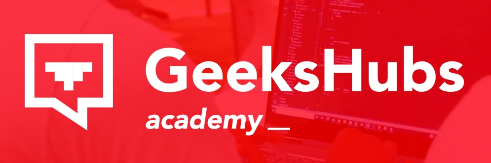
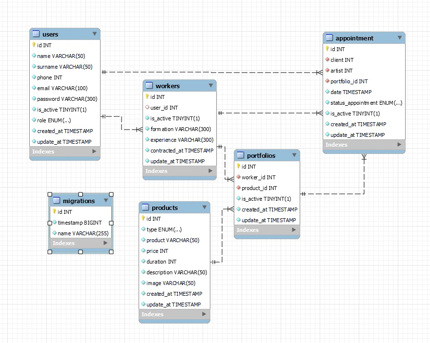

# README - ☠️ Estudio de Tatuajes ☠️
__<p align="center">Proyecto 4 - Full Stack Developer Bootcamp en GeeksHubs Academy </p>__

<p>
   <div align="center">
      
   </div>    
</p>

<p align="center">Backend de un estudio de tatuajes, por Marta Guillem Olmos.
<br></p>


## 📋 Contenido del Readme

- ### 🚀 [Descripcion](#Descripcion)
- ### 🎯 [Objectivo](#objectivo)
- ### 🛠️ [Tecnologías Utilizadas](#tecnologías-utilizadas)
- ### 📉 [Diagrama de la Base de Datos](#diagrama-de-la-base-de-datos)
- ### 💡 [Endpoints](#endpoints)
- ### ⚙️ [Instrucciones de uso](#instrucciones-de-uso)
- ### 👏 [Agradecimientos](#agradecimientos)
- ### 📧 [Contacto](#contacto)


## 🚀 Descripcion

En este proyecto, hemos recreado el backend de un estudio de tatuajes haciendo uso de tecnologías como Node.js, TypeScript, Express, MySQL, GIT y GitHub. El desarrollo de este proyecto se basa en una base de datos relacional gestionada con TypeORM. Hemos implementado diversos endpoints que detallaremos a continuación. Estos endpoints nos permiten restringir el acceso a las rutas, acceder a la información de la base de datos, actualizarla y eliminarla según sea necesario.


## 🎯 Objetivo

El proyecto "Estudio de tatuajes" se centra en crear un sistema backend sólido y completo destinado a gestionar las citas en un estudio de tatuajes, cuyos objetivos son los siguientes:

- **Desarrollar una API robusta**: Crear una API escalable y segura que permita a los usuarios (clientes y tatuadores) interactuar con el sistema de gestión de citas.
- **Gestión de usuarios**: Ofrecer un conjunto completo de funciones para administrar los usuarios, incluyendo registro, inicio de sesión, gestión de perfiles y actualización de datos personales.
- **Gestión de citas**: Facilitar a los clientes la visualización de sus citas, así como modificar y cancelar citas con tatuadores. 
- **Gestión de trabajadores y sus portfolios**: Brindar a los trabajadores la capacidad de crear nuevos productos que se incluirán en sus portfolios, así como permitirles modificar el estado de las citas. Además, también podrán solicitar citas como usuarios.

En resumen, el proyecto tiene como objetivo principal la creación de un sistema completo de gestión de citas para un estudio de tatuajes, garantizando una experiencia de usuario intuitiva y segura.


## 🛠️ Tecnologías Utilizadas

<div align="center">
<a href="https://www.mysql.com/">
    
</a>
<a href="https://www.expressjs.com/">
    
</a>
<a href="https://nodejs.org/es/">
    
</a>
<a href="https://www.typescriptlang.org/">
    
</a>
  <a href="https://git-scm.com/">
    
</a>
  <a href="https://www.postman.com/">
    
</a>
</div>

</details>


## 📉 Diagrama de la base de datos

<p>
   <div align="center">
      
   </div>    
</p>


## 💡 Endpoints
<details>
<summary><h4>/user</h4></summary>

<h5> 1- Crear un usuario </h5>
- Descripción: Crear un nuevo usuario, recuperando la información de los campos requeridos a través del body. Y, se genera un registro en la base de datos de un nuevo usuario con el rol de "user".

        http
        POST http://localhost:4000/user
        
        
        json
        {
            "name": "Paula",
            "surname": "Guillem Olmos",
            "phone": 627880704,
            "email": "paulaguillem@gmail.com",
            "password": " 123456"
        }
        
<h5> 2- Login </h5>
- Descripción: Al acceder, nos devuelve un token a través del body que utilizaremos más tarde en las rutas habilitadas para los usuarios.


        http
        POST http://localhost:4000/user/login
        
        
        json
        {
     
            "email": "paulaguillem@gmail.com",
            "password": " 123456"
        }
        
<h5> 3- Acceder al perfil </h5>
- Descripción: A través de esta ruta nos envía la información del perfil al que accedemos.

        Auth : User
        Barer token : Token
        - Este token es el que hemos obtenido al hacer login con nuestro email y password.
        
        http
        GET http://localhost:4000/user/profile
        
<h5> 4- Actualizar la información del perfil </h5>
- Descripción: En esta ruta podemos indicar el perfil del usuario a actualizar de dos formas diferentes, en función del role con el que se acceda.
En esta ruta he habilitado, que en caso de ser SuperAdmin se pueda modificar los datos de un usuario, introduciendo el id del usuario a través del búscador.
En este caso, si el usuario, quiere desactivar la cuenta, debería modificar el estado de is_active a false.

        Auth : User o Super_Admin
        Barer token : Token
  
        
        http
        PUT http://localhost:4000/user/:id?

        json
        {
            "name":
            "surname":
            "phone":
            "email": 
            "is_active": 
        }
        - Los campos que indicamos a través del json son opcionales.

<h5> 5- Modificar el password </h5>
- Descripción: Hemos creado una ruta única para modificar el password. Antes de realizar la modificación, solicitamos junto con la nueva contraseña la antigua para comprobar que es la misma que teníamos almacenada en la base de datos.

        Auth : User 
        Barer token : Token
       
        
        http
        PATCH http://localhost:4000/user/password

        json
        {
            "passwordOld":
            "password":
         
        } 

<h5> 6- Eliminar el usuario </h5>
- Descripción: A través de esta ruta, eliminaremos un usuario por su Id. Enviaremos la información del user_id que queremos eliminar a través del body.

        Auth : Super_Admin
        Barer token : Token
        
        http
        DELETE http://localhost:4000/user

        json
        {
            "id":
         
        } 
<h5> 7- Recuperar la información de todos los usuarios. </h5>
- Descripción: Tan sólo el super_admin puede acceder al listado de usuarios registrados.

        Auth : Super_Admin
        Barer token : Token

        http
        GET http://localhost:4000/user
        
</details>

<details>
<summary><h4>/worker</h4></summary>
<h5> 1- Crear un trabajador </h5>
- Descripción: Tan sólo el super_admin puede crear un nuevo trabajador. Para ello, lo que haremos será solicitar a través del body la Id del usuario que queremos que forme parte de nuestra pantilla y, de forma predeterminada, genera en los campos de "formación" y "experiencia" un mensaje de bienvenida.

        Auth : Super_Admin
        Barer token : Token

        http
        POST http://localhost:4000/worker
        
        
        json
        {
            "user_id": 
        }

<h5> 2- Actualizar datos de un trabajador </h5>
- Descripción: Tanto el propio trabajador como el Super_Admin pueden actualizar la información de un trabajador. En el caso del super admin, nos enviará la información de la Id de Worker que quiere actualizar.
Si el trabajador quiere desactivar su cuenta, deberá modificar el estado is_active a false.

        Auth : Admin y Super_Admin
        Barer token : Token

        http
        POST http://localhost:4000/worker/:id?
        
        
        json
        {
            "formation": 
            "experience": 
            "is_active":
        }
        - Todos los campos a actualizar son opcionales.

<h5> 3- Eliminar un trabajador </h5>
- Descripción: A través de esta ruta, eliminaremos un trabajador por su Id. Enviaremos la información del worker_id que queremos eliminar a través del body.
Al eliminarlo, modificaremos el rol de admin a user.

        Auth : Super_Admin
        Barer token : Token
        
        http
        DELETE http://localhost:4000/worker

        json
        {
            "id":   
        } 

<h5> 4- Recuperar la información de todos los trabajadores. </h5>
- Descripción: Tan sólo el super_admin puede acceder al listado de trabajadores registrados.

        Auth : Super_Admin
        Barer token : Token

        http
        GET http://localhost:4000/user

</details>

<details>
<summary><h4>/product</h4></summary>
<h5> 1- Crear un producto </h5>
- Descripción: Tan sólo el super_admin y los trabajadores pueden crear un nuevo producto.

        Auth : Super_Admin y Admin
        Barer token : Token

        http
        POST http://localhost:4000/product
        
        
        json
        {
            "type": 
            "product": 
            "price": 
            "duration":
            "description": 
            "image": 
        }
        - Todos los campos son obligatorios.

<h5> 2- Actualizar un producto </h5>
- Descripción: Tan sólo el super_admin y los trabajadores pueden actualizar un producto. Para ello, le enviamos a través del body el id del producto que queremos modificar.

        Auth : Super_Admin y Admin
        Barer token : Token

        http
        PUT http://localhost:4000/product
        
        
        json
        {
            "id":
            "type": 
            "product": 
            "price": 
            "duration":
            "description": 
            "image": 
        }
        - El único campo que es obligatorio es el id, acompañado del campo que se quiera actualizar.

<h5> 3- Eliminar un producto </h5>
- Descripción: A través de esta ruta, eliminaremos un producto por su Id. Enviaremos la información del product_id que queremos eliminar a través del body.

        Auth : Super_Admin
        Barer token : Token
        
        http
        DELETE http://localhost:4000/product

        json
        {
            "id":   
        } 

<h5> 4- Recuperar la información de todos los productos. </h5>
- Descripción: Todos los usuarios pueden visualizar la información de los productos.

        http
        GET http://localhost:4000/product

</details>

<details>
<summary><h4>/portfolio</h4></summary>
<h5> 1- Crear un portfolio </h5>
- Descripción: Tan sólo el super_admin y los trabajadores pueden crear un portfolio. En este caso, hemos utilizado la misma ruta para poder llevar a cabo esta función.
En el caso del Super_Admin, recupera el id del trabajador al que se va a relacionar dicho producto por el navegador. En el caso de contar con un rol Admin, el id del trabajador lo recuperará del token.

        Auth : Super_Admin y Admin
        Barer token : Token

        http
        POST http://localhost:4000/portfolio/:id?
        
        
        json
        {
            "product_id":
        }

<h5> 2- Actualizar un portfolio </h5>
- Descripción: El Super_Admin puede actualizar cualquier portfolio, en cambio, los trabajadores, tan sólo pueden actualizar un portfolio que les pertenezca a ellos.
Los trabajadores no pueden eliminar un portfolio, tan sólo pueden desactivarlos, is_active = false.

        Auth : Super_Admin y Admin
        Barer token : Token

        http
        PUT http://localhost:4000/portfolio
        
        
        json
        {
            "portfolio_id":
            "product_id":
            "is_active": 
        }
        - El único campo que es obligatorio es el portfolio_id, acompañado del campo que se quiera actualizar.

<h5> 3- Eliminar un portfolio </h5>
- Descripción: A través de esta ruta, eliminaremos un portfolio por su Id. Enviaremos la información del product_id que queremos eliminar a través del body.

        Auth : Super_Admin
        Barer token : Token
        
        http
        DELETE http://localhost:4000/portfolio

        json
        {
            "id":   
        } 
<h5> 4- Recuperar la información de todos los portfolios. </h5>
- Descripción: Solo los usuarios registrados pueden acceder a la información de todos los portfolios.

        Auth : Super_Admin, Admin y User
        Barer token : Token

        http
        GET http://localhost:4000/portfolio

</details>

<details>
<summary><h4>/appointment</h4></summary>
<h5> 1- Crear una cita </h5>
- Descripción: Tan sólo los usuarios con los roles de "users" y "admin", el último caso se refiere a los trabajadores pueden crear una cita.
Recuperamos el id del cliente a través del token, independientemente del rol que tenga y por otro lado, el id del artista a través del portfolio que hemos seleccionado.

        Auth : User y Admin
        Barer token : Token

        http
        POST http://localhost:4000/appointment
        
        
        json
        {
            "portfolio_id":
            "date": '{AAAA} MM-DDTHH:mm:ss SSS [Z] A',
        }
        - Ambos campos son obligatorios para poder crear una cita.
    
    Al crear la cita, el estado de la misma, adquiere el valor "pending". Y, este estado tan sólo lo podrá modificar el trabajador.

<h5> 2- User: Actualizar una cita </h5>
- Descripción: El usuario, independientemente del rol que tenga: user o admin. Puede modificar una de las citas que ha solicitado.

        Auth : Super_Admin y Admin
        Barer token : Token

        http
        PUT http://localhost:4000/appointment/user
        
        
        json
        {
            "appointmentId":
            "portfolio_id":
            "date":
            "is_active": 
        }
        - El único campo que es obligatorio es el appointmentId, acompañado del campo que se quiera actualizar.

    Al realizar la actualización, el campo status, vuelve a transformarse en pendiente.

<h5> 3- Worker: Actualizar una cita </h5>
- Descripción: El trabajador puede modificar el estado de la cita.

        Auth : Admin
        Barer token : Token

        http
        PUT http://localhost:4000/appointment/worker
        
        
        json
        {
            "id": 
            "status_appointment": 
        }
        - El único campo que es obligatorio es el id, acompañado del campo que se quiera actualizar.

<h5> 4- Eliminar una cita </h5>
- Descripción: A través de esta ruta, el Super_Admin, podrá eliminar una cita por su Id.

        Auth : Super_Admin
        Barer token : Token
        
        http
        DELETE http://localhost:4000/appointment

        json
        {
            "id":   
        } 

<h5> 4- Recuperar la información de todas las citas </h5>
- Descripción: Solo el Super_Admin podrá acceder a la información de todas las citas.

        Auth : Super_Admin
        Barer token : Token

        http
        GET http://localhost:4000/appointment

<h5> 5- User: Recuperar la información de todos las citas. </h5>
- Descripción: El usuario podrá acceder a la información de todas las citas.

        Auth : User
        Barer token : Token

        http
        GET http://localhost:4000/appointment/user

<h5> 6- Admin: Recuperar la información de todos las citas. </h5>
- Descripción: El trabajador podrá acceder a la información de todas las citas.

        Auth : Admin
        Barer token : Token

        http
        GET http://localhost:4000/appointment/worker

<h5> 7- Admin: Recuperar la información de todos las citas, filtrandolas por su status. </h5>
- Descripción: El trabajador podrá acceder a la información de todas las citas, filtrado el estado de las mismas previamente.

        Auth : Admin
        Barer token : Token

        http
        GET http://localhost:4000/appointment/status

        json
            {
                "status":   
            } 


</details>


## ⚙️ Instrucciones de uso

<details>
<summary> Instrucciones</summary>

1. Clona este repositorio en tu máquina local usando el siguiente comando: `git clone [URL del repositorio]`.
2. A continuación instala todas las dependencias con el comando ` $ npm install `
3. Conectamos nuestro repositorio con la base de datos mediante las credenciales en el archivo db.ts o, en este caso, con las variables de entorno que se encuentran en el archivo .env

    ``` js
        PORT = 
        
        DB_TYPE = 
        DB_HOST =
        DB_PORT = 
        DB_USERNAME =
        DB_PASSWORD = 
        DB_NAME = 

        JWT_SECRET = 
    ```  

4. Ejecutamos las migraciones mediante el comando `npx typeorm-ts-node-commonjs migration:run -d ./src/db.ts` 
5. Si estamos en desarrollo, lo hacemos funcionar y actualizarse en tiempo real mediante el comando `npm run dev`
6. Si queremos compilar usamos el comando `npm run build`
7. Si estamos en producción, lo ponemos en marcha con el comando `npm run start`
8. Usamos los endpoints almacenados en la carpeta http para usar las distintas funcionalidades que se han diseñado.

</details>

## 👏 Agradecimientos
Este proyecto es el reflejo de todos los conocimientos que he adquirido hasta la fecha en el BootCamp FullStack Developer. 
Este apartado lo quiero dedicar a mis profesores, Dani Tarazona y David Ochando. Gracias a sus clases, he sido capaz de desarrollar desde cero una base de datos, sin conocimientos previos. 
Sus explicaciones del funcionamiento de la misma y la mentorización a la hora de desarrollar el esquema, ha hecho posible este proyecto.

## 📧 Contacto

Puedes contactar conmigo por correo electrónico [martaguillem@outlook.es](mailto:martaguillem@outlook.es). Y, no dudes en seguirme en GitHub y Linkedin.

- ***Marta Guillem Olmos***  
 [GitHub]((https://github.com/martaguillemolmos))   | [LinkedIn](https://www.linkedin.com/in/marta-guillem-olmos-b26b9b293/)